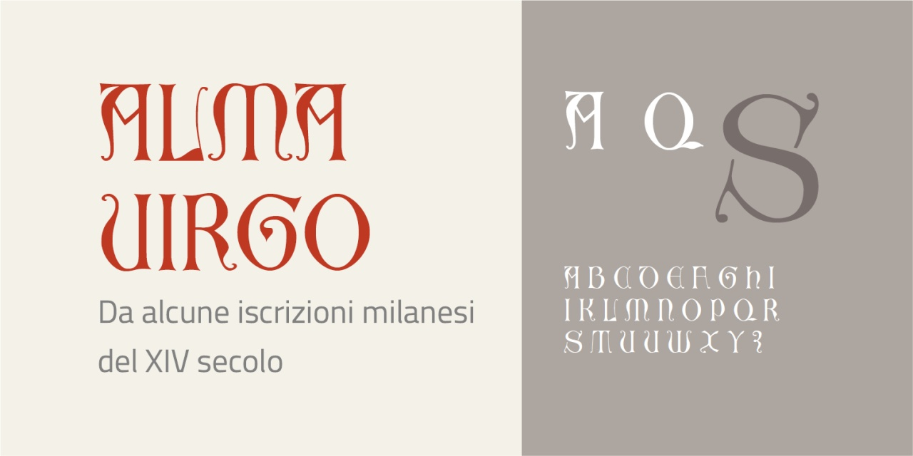

# Alma Virgo
* Versione 1.0: versione iniziale

Per testare il font, vedere la [pagina interattiva](https://m-casanova.github.io/AlmaVirgo/).

## Descrizione

_Alma Virgo_ è un font basato su iscrizioni milanesi del XIV secolo
(una sul [campanile di San Gottardo in Corte](https://commons.wikimedia.org/wiki/File:7175_-_Milano_-_Dedica_di_San_Gottardo_in_Corte_datata_1336_-_Foto_Giovanni_Dall%27Orto,_26-Feb-2008.jpg)
e una sulla [loggia degli Osii](https://commons.wikimedia.org/wiki/File:4886_-_Milano_-_Loggia_degli_Osii_-_Foto_Giovanni_Dall%27Orto,_23-Jan-2008.jpg)).

Sono presenti alcune legature storiche ('hlig') e alcune varianti dei caratteri ('ss01', 'ss02', 'ss03', 'ss04', 'ss05' e 'ss06').

Il nome _Alma Virgo_ deriva dall'inizio dell'iscrizione del 1336 presente sul campanile di San Gottardo in Corte.
